# Dacha video Durable  fuctionas - Оркестратор обчислень. 

Використовується для  управлінням обробником відеофайлів. 
Виконує запуск обробника та  отримує рзультат виконання роботи обробником.

## Корисна документація

- [Повний перелік окументації по azure durable function](https://learn.microsoft.com/en-us/azure/azure-functions/durable/);
- [типві сценарії використання azure durable fuction](https://learn.microsoft.com/en-us/azure/azure-functions/functions-overview);
- [Application patterns](https://learn.microsoft.com/en-us/azure/azure-functions/durable/durable-functions-overview?tabs=in-process%2Cnodejs-v3%2Cv1-model&pivots=python#application-patterns);
- [Use the Azurite emulator for local Azure Storage development](https://learn.microsoft.com/en-us/azure/storage/common/storage-use-azurite?toc=%2Fazure%2Fstorage%2Fblobs%2Ftoc.json&bc=%2Fazure%2Fstorage%2Fblobs%2Fbreadcrumb%2Ftoc.json);

## Програмна архітектура додатку, що побудовано на  durable function

Програмна архітектура додатку показана на [pic-01](#pic-01).

<kbd>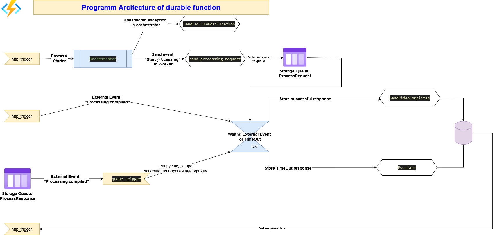</kbd>
<p style="text-align: center;"><a name="pic-01">pic-01</a></p>

При розробці архітектури використано шаблон [Pattern #5: Human interaction](https://learn.microsoft.com/en-us/azure/azure-functions/durable/durable-functions-overview?tabs=in-process%2Cnodejs-v3%2Cv2-model&pivots=python#human) з докуентації [pic-02](#pic-02). коли функція виступає як event - driven оркестратор.

<kbd></kbd>
<p style="text-align: center;"><a name="pic-02">pic-02</a></p>

Основним діючим компонентом durable function є **оркестратор**. В ньому описується, яким чином запускаються інші програмні компоненти- функції, триггери, на які події і як реагувати.
**Оркестратор** запускається тригером, що являє http post запит. Для локальної розробки та відлагодження використання http  тригера є дуже зручним. В реальності ж там повинен бути тригер, що "слухає" event greed. Але поки що, для простоти, використовуємо http trigger.

По http-тригеру **Оркестратор** запускає фукнцію публікації повідомлення в чергу, яку "слухає" worker, що є сигналом для початку обробки відеофайу і, зразу, після публікації, оркестратор переходить в режим очікування зовнішньої події. **Оркестратор** очікує зовнішню подію заданий період часу. Якщо в заданий період подія не надійшла, то очікування буде перевано і функція завершить роботу з результатом виконання функції **timeout**.

В розробленій функції зовнішня подія може надійти по http-тригеру  чи  по тригеру черги Storage Queue. В обох випадках в повідомленні черги чи в http body  надійде статус обробки відеофайлу. Отримавши  зовнішню подію, оркестратор перериває очікування і завершує роботу результатом виконання функції **processed**.

На додаток, у випадку генерації помилки на бульякому кроці робти durable function, генерується подія **SendFailureNotification**, що гарантує завершення роботи durable function та отримання відповіді з помилкою. Що є теж дуже важливим кроком. На цей крок якось не знайшов наголосу в документації, але його наявність надважлива, так як гарантує, що функція завжди завершить свою роботу.  

В розподілених асинхроних додатках це дуже важливий шаблон  проектування і важливо вміти його проектувати, розробляти та тестувати.

## Запуск проекту локакльно

Перед роботю в azure functioin в середовищі visual studio code потрібно встановити:

- плагін Azure Tools

<kbd></kbd>
<p style="text-align: center;"><a name="pic-04">pic-04</a></p>

- локальний емулятор Azure Storage  [Azurite emulator for local Azure Storage development](https://learn.microsoft.com/en-us/azure/storage/common/storage-use-azurite?toc=%2Fazure%2Fstorage%2Fblobs%2Ftoc.json&bc=%2Fazure%2Fstorage%2Fblobs%2Fbreadcrumb%2Ftoc.json);

1. Склонувати git repo командою

```bash
git clone
```
2. Створити python virtual environment та її авктивізувати

```bash
# створення virtual env
py -m venv env

# активація virtual env
.\env\Scripts\activate.ps1  

```

3. Встановити залежності

```bash
# установка пакетів "чистих" без тестових кейсів
pip install -r requirements.txt
# установка пакетів для середовища розробки з врахуванням пакетів тестових кейсів  requirements.txt + Jupyter notebooks пакети
pip install -r requirements-dev.txt

# Реєстрація Jupyter notebook kernel для тестових кейсів
python -m ipykernel install --user --name my-durable-env --display-name "Python (Durable Project)"

```

3.1. Налаштування local.setting.json

**local.setting.json** 

```json
{
  "IsEncrypted": false,
  "Values": {
    "AzureWebJobsStorage": "****",  //Налаштувати conect string  до локального Azurite
    "FUNCTIONS_WORKER_RUNTIME": "python",
    "PYTHONIOENCODING": "UTF-8"
  }
}
```


4. Запуск функції

- Запуск функції в режимі debug показано на  [pic-03](#pic-03)

<kbd>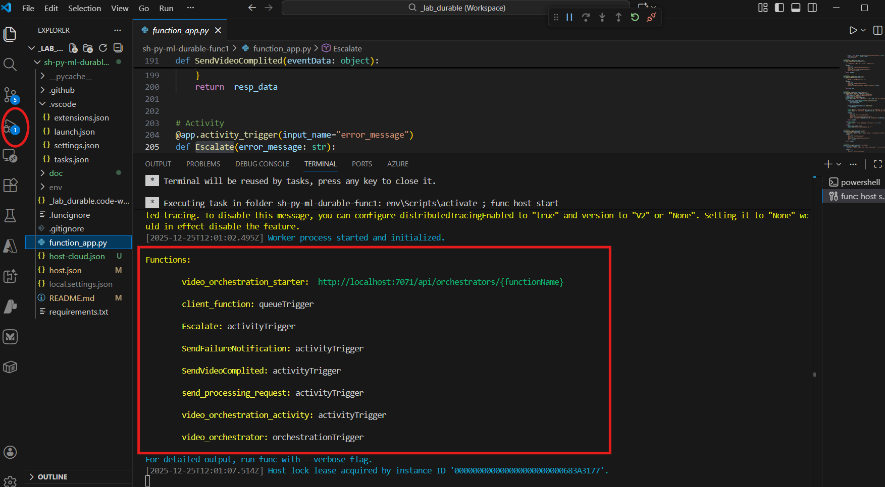</kbd>
<p style="text-align: center;"><a name="pic-03">pic-03</a></p>

- запуск функції з командного рядку:

```bash
func start

```

При запуску потрібно особливу увагу звернути на конфігурацію файла [host.json](https://learn.microsoft.com/en-us/azure/azure-functions/durable/durable-functions-bindings?tabs=in-process%2C2x-durable-functions&pivots=programming-language-python#durable-functions-settings-in-hostjson).  В показаному прикладі в ключі "logging"  вказано частину функцій, що вимагають логування з рівнем debug. Якщо не вказати які функціх логувати, то в application insights  не буде записів прикладнго логу.


```json
{
  "version": "2.0",
  "extensionBundle": {
    "id": "Microsoft.Azure.Functions.ExtensionBundle",
    "version": "[4.*, 5.0.1)"
  },
  "logging": {
      "fileLoggingMode": "always",
      "logLevel": {
        "default": "Information",  
        "Host.Aggregator": "Information",
        "Host.Results": "Information",
        "Function.video_orchestrator": "Debug",
        "Function.client_function": "Debug",
        "Function.client_function.User": "Debug" 
      },
      "console": {
          "isEnabled": true,
          "DisableColors": false
      }
  },
  "functionTimeout": "00:15:00"
}

```

## Розгортаня в хмарі Azure

Розгортання в хмарі виконується через репозиторій github  та github action. GitHub Action flow  створюється прямо підчас створення функціонального додатку з  маркетплейсу.

1. На маркетплейсі знайти сервіс function app  та вибрати план **Flex Consumption**

<kbd>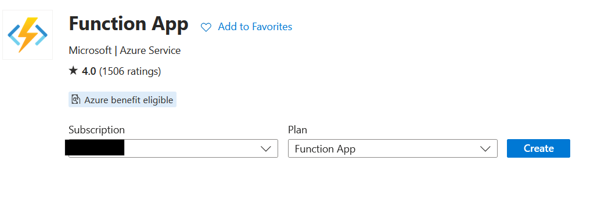</kbd>
<p style="text-align: center;"><a name="pic-07">pic-07</a></p>


<kbd>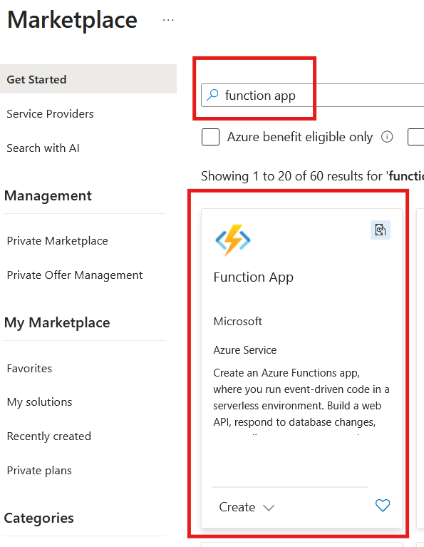</kbd>
<p style="text-align: center;"><a name="pic-05">pic-05</a></p>


<kbd>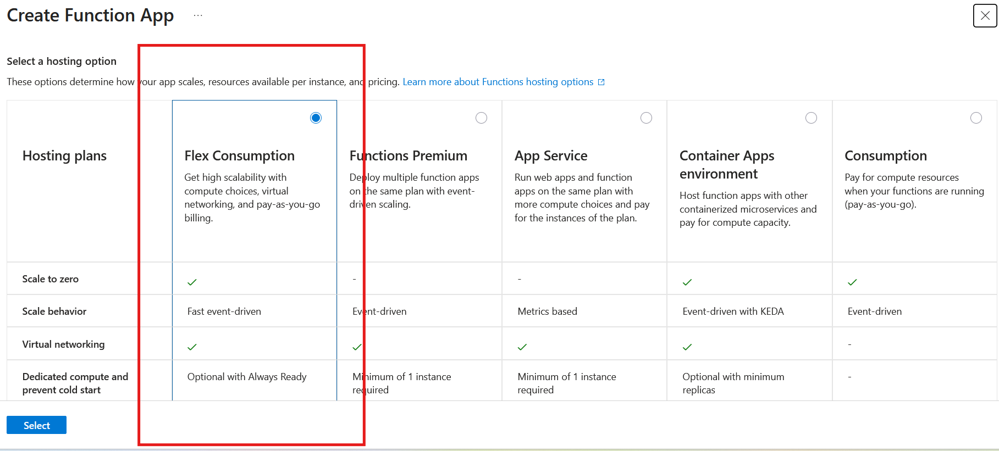</kbd>
<p style="text-align: center;"><a name="pic-06">pic-06</a></p>

2. Вказати параметри тарифного плану


<kbd>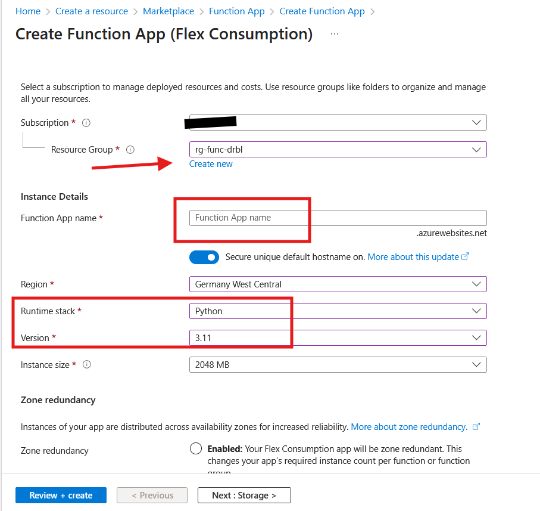</kbd>
<p style="text-align: center;"><a name="pic-08">pic-08</a></p>

Тут треба не забути, що у вас буде розгортатися не один сервіс, а кілька, тому, на мій погляд, для кожного додатку краще створвати свою Resource Groupe,  щоб розуміти скільки фінансів вона споживає вцілому. Також потрібно звернути увагу на runtime stack. Я беру версію пітона на одну нижче останньої - тому що остання не у всіх центрах є і вона часто дослідницька. Параметри redundancy та пам'яті  для прототипу вибираю мінімальні.

2. Створити storage account

<kbd>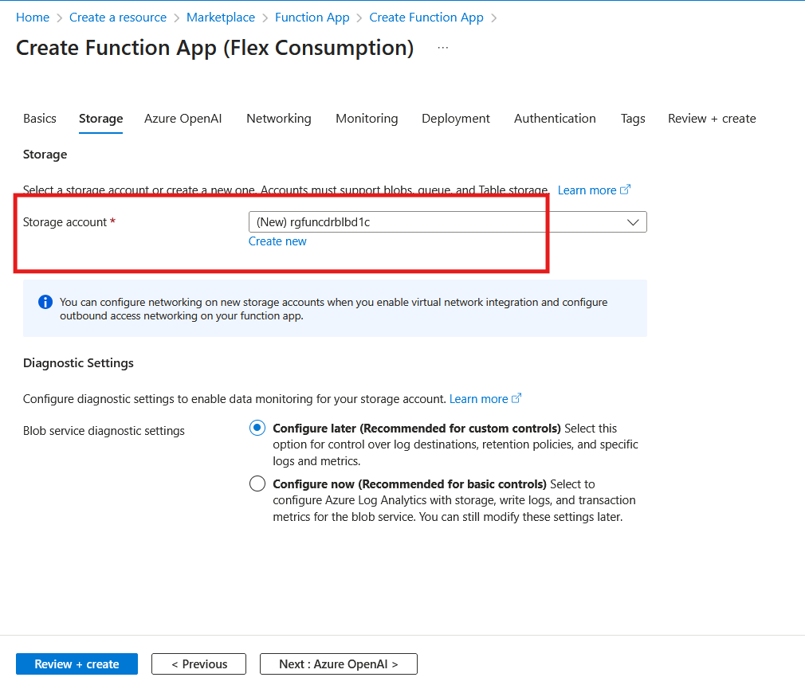</kbd>
<p style="text-align: center;"><a name="pic-09">pic-09</a></p>

З приводу створення stroage account  потрібно зазначити, що кожний функціональний додатко вимагає створення storage account, що використовується тільки для цього, окремо взятого функціонального додатку. Може виникати природнє бажання зекономити і розмістити на цьому ж storahe account прикладні дані. Але робити цього не потрібно. Для даних створіть окремий storage account.

- По переше, якщо дані розміщені окремо від даних додатку - то повне видалення додатку не призведе до видалення даних.

- По друге, storage account  для функціонального додатку має жорсткі обмеження по доступу і щоб забезпечити доступ інших додатків чи користувачів - цю модель доступу прийдеться змінювати, що може привести до непередбачуваних наслідків.  

2. Налаштування  NetWorking

Тут залишається все без змін, якщо не потрібно щось більш специфічне

<kbd></kbd>
<p style="text-align: center;"><a name="pic-10">pic-10</a></p>


3. Налаштувати Application Insights для логування

Тут треба зазначити, що маючи кілька Application Insights маєте можливість вибрати в який з них "складати" логи  

<kbd>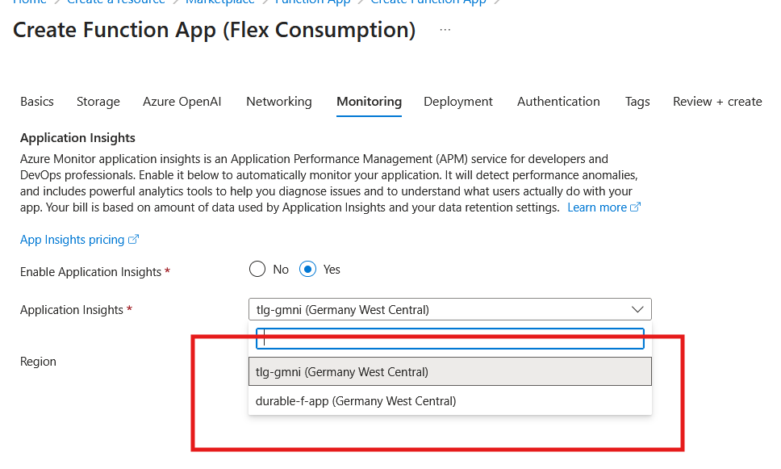</kbd>
<p style="text-align: center;"><a name="pic-11">pic-11</a></p>

4. Налаштувати параметри deployment

Для автоматичного розгортання, це мабуть, найважливіша вкладка.

<kbd>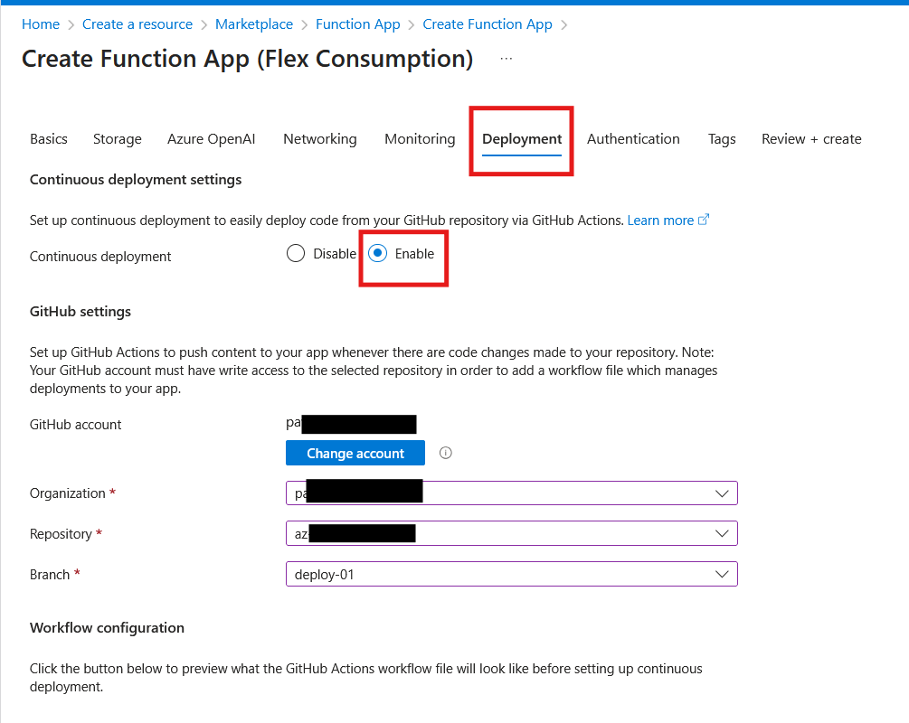</kbd>
<p style="text-align: center;"><a name="pic-12">pic-12</a></p>

<kbd>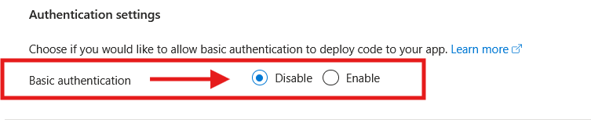</kbd>
<p style="text-align: center;"><a name="pic-13">pic-13</a></p>

Тут ви вказуєте свій Github account, репозиторій та branch. Я експериментував з різними бренчами і прийшов до висновку, що для розгортання краще створювати окремий branch,  який буде створюватися з master, типу deploymen-01, deployment-02, щоб у випадку невдач з deployment у вас не було 100-500 файлів з github actions. простіше видалити branch ніж вирішувати merge-конфлікти.

5. Створеня самого функціонального додатку

В процесы створення додатку у вас автоматично запуститься deployemnt з github.
Процес deplyment  можна спостерігати на порталі Azure, 

<kbd>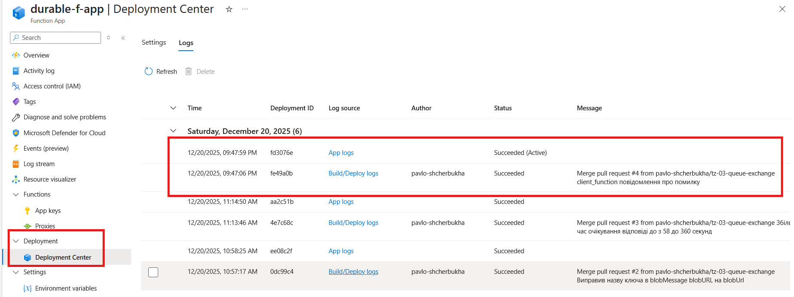</kbd>
<p style="text-align: center;"><a name="pic-14">pic-14</a></p>

або в github. 

Тут потрібно звернути увагу, що в залежності від пакетів, які ви використовуєте, може знадобитися включеня опції віддаленого розгортання. Тобто всі залежності розгортаються прямо на сервері де будн запускатися  функціональне app.  Для цього потрібно додати доатковий параметр в файл github actions:


<kbd>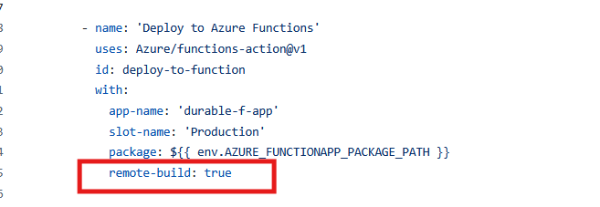</kbd>
<p style="text-align: center;"><a name="pic-15">pic-15</a></p>

```text
 remote-build: true
 ```

 У випадку успішного розгортання можна побачити всі програмні функції вашого додатку

<kbd>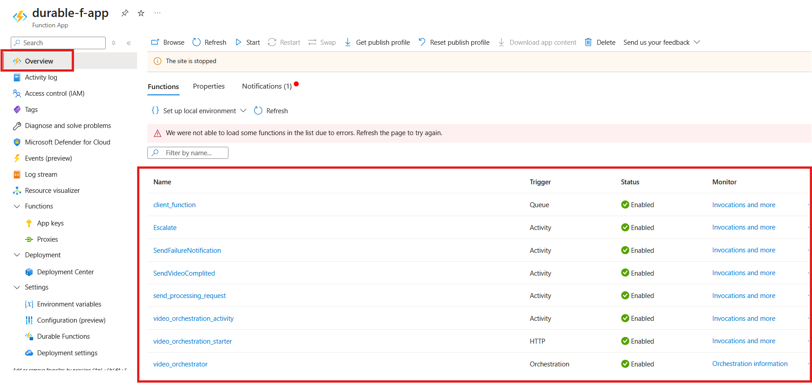</kbd>
<p style="text-align: center;"><a name="pic-16">pic-16</a></p>

А внести потрібні вам env змінні можна в цьому меню:

<kbd>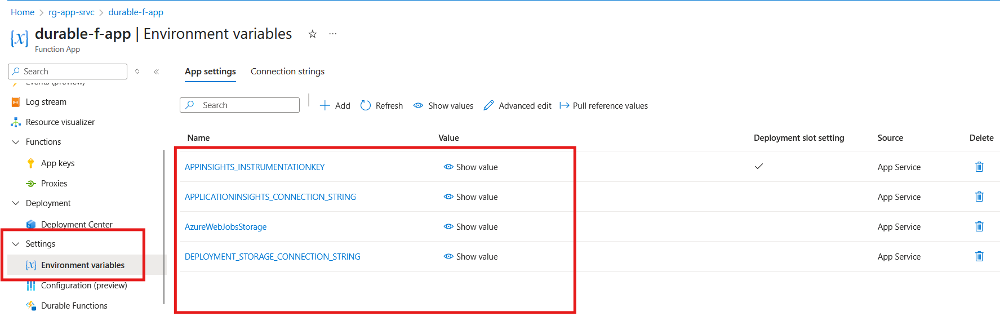</kbd>
<p style="text-align: center;"><a name="pic-17">pic-17</a></p>


## Тестування оркестратора

Тестування оркестратора виконати за допомгою якогось postman  чи за допомогою curl  виконувати дуже не зручно. Тому, для тестування використано jupyter notebook.
Тестові кейси знаходяться в каталозі **/tests**. 
Структура підкаталогів: 

```text
my-durable-app/
├── function_app.py          # Основний код функцій
├── host.json
├── requirements.txt         # Тільки те, що потрібно для роботи в Azure
├── requirements-dev.txt     # Пакети для розробки та Notebooks (pytest, jupyter, matplotlib)
├── .env                     # Локальні змінні (URL-адреси, ключі для  Notebooks)
├── tests/                   # Папка для всіх видів тестів
│   ├── notebooks/           # Ваші інтерактивні тестувальні ноутбуки
│   │   └── durable-func-test.ipynb Інтерактивні тести для локального запуску durablr function 
│   │   
│   ├── data/                # Тестові JSON-пейлоади, відео-приклади
│   │   └── payload.local.json       # JSON  для запуску функції локально
│   │   └── purge-payload.local.json # JSON  для очистки всіх екземплярів функції
│   │   └── event-payload.local.json # JSON  з зовнішньою подією, що сповіщає про закінчення обробки відеофайла
│   └── test_utils.py        # Спільний Python-код для тестів, Helper
│   └── __init__.py          # Вказує, що в цьому каталозі знаходиться модуль

```
Для запуску тестів  при  локальному запуску функції


1. В кореневому каталозі проетка створити **.env** файл, який включає такі змін

```text
STORAGE_CONNECTION_STRING="Налаштування connect string  до локального blob storage (azurite)"
ORCHESTRATOR_HOST="http://localhost:7071 (host URL  вашої функції)"
```

2. Активувати virtual environmemt, якщо не активована

``` bash
.\env\Scripts\activate.ps1
``` 

3. Реєстрація ядра Jupyter Notebook kernel з назвою "Python (Durable Project)"

```bash
python -m ipykernel install --user --name my-durable-env --display-name "Python (Durable Project)"
```

4. Запустити Jupyter Notebook та перевірити щоб до неї був підключений саме цей kernel.  Якщо інший, то переключити в меню управління kernel. 

5. Запустити azurite та в режимі debug програмний код durablr function.  

Саме тестування відбувається інтерактивно, практично, як на web-формочці. Для тестування потрібно запустити notebook **durable-func-test.ipynb**.
Всі деталі проведення тестів винесені в модуль **test_utils**, а тестові json  винесені в файли в **/tests/data**. Перш, ніж запускати тести, потрібно  імпортувати пакети, підключити модуль **test_utils**,  та прочитати env  змінні з файла **.env**, щи виконується в першій обчислювальній комірці.

Тестування складається з таких кроків:
 
1. Запуск Orchestrator Function

На цьому єтапі вичитується тестовий json  що приймає стартер оркестратора. При успішному старті в чергу Storage Queue, що "слухає" обробник відеофайлів публікується відповідне повідомлення, а в NoteBook  повертається відповідь у вигляді JSON, що надає:
- ідентифікатор instance ;
- URL  для перевірик статусу виконання завдання;
- URL  для переривання виконання завдання
- URL  для передачі зовнішньої події, що завершить завдання

2. Моніторинг Стану Оркестратора

Цю комірку можна запускати на виконання багато разів. Вона моніторить стан виконання завдання. А якщо воно виконалося- то повертає статус і результат. Якщо ж виконання було перервано - то повертає просто відповідний статус.

3. Припинити виконання завдання

Комріка або насильно  завершить виконання завдання. Або ж поверне помилку, якщо такого завдання серед виконуваних не знайдено.

4. Очищення історії виконання інстансу

При запуску durable function  кожне завдання має свій instance_id  і результат виконання завдання теж зберінається за цим ідентифікатором. Тому, якщо інстанс завершився  помилкою чи взагалі   історя не потрібна більше - то його історію можна поистити на цьому корці.

5. Вичистити взагалі всю історію всіх інстансів

Вичищає історію по всіх інстансах.


6. Надсилання зовннішньої події по HTTP для зупинки очікування оркестатора

Цей крок відноситья до unit тестів. За його допомогою моделюється повідмлення від обробника відеофайла про успішну обробку файла по http. Якщо повідомлення прийшло до закінчення інтервалу очікування, то функція успішно завершить свою роботу і виконавши повторно  пункт **"2. Моніторинг Стану Оркестратора"** отримаємо результат обробки відеофайлу.


7. Надсилання зовннішньої події за допомогою черги для зупинки очікування оркестатора

Цей крок  також відноситья до unit тестів. За його допомогою моделюється повідмлення від обробника відеофайла про успішну обробку файла через Storage Queue. Якщо повідомлення прийшло до закінчення інтервалу очікування, то функція успішно завершить свою роботу і виконавши повторно  пункт **"2. Моніторинг Стану Оркестратора"** отримаємо результат обробки відеофайлу.  Обробник якраз і спілкується з оркестратором durable function  через черги. І це один з бонумсів, що дозволяє легко відлагодити і протестувати кожний компонент окремо.


